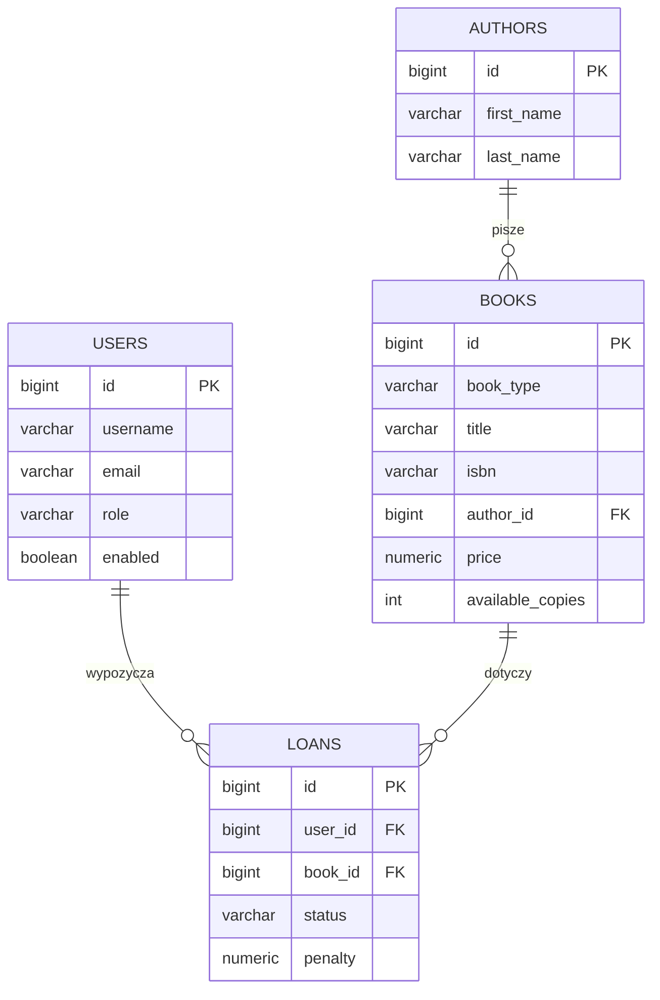
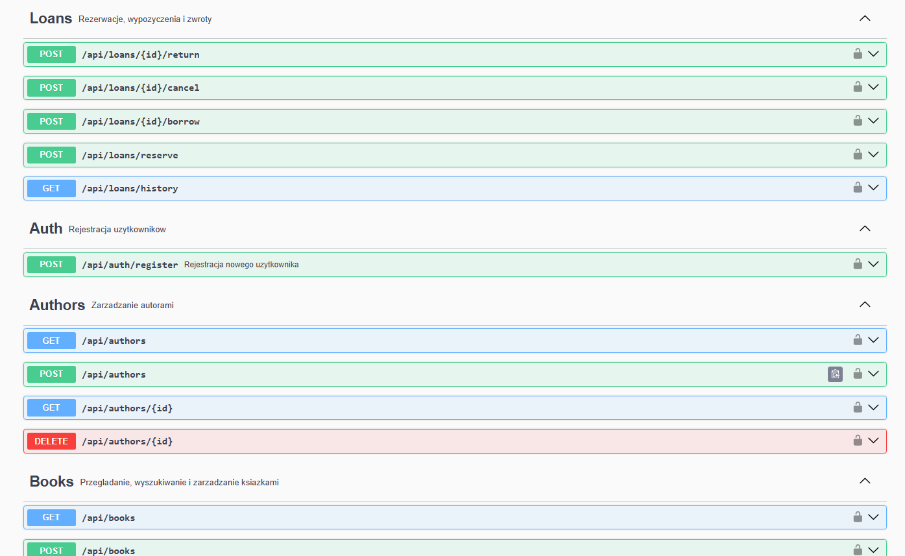
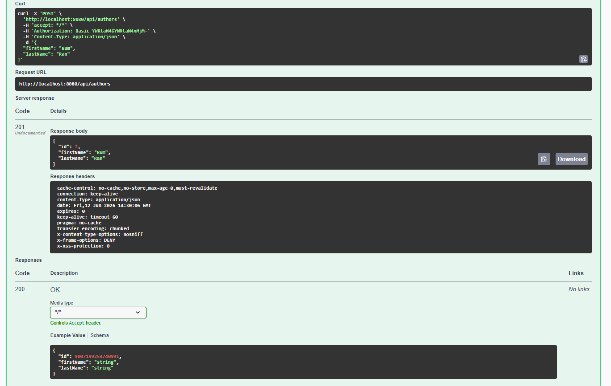
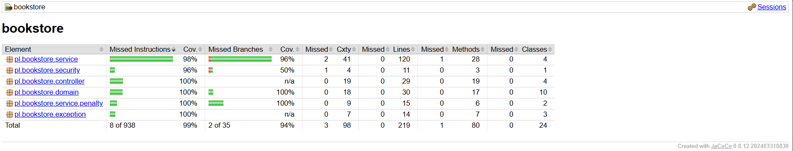
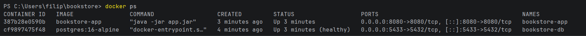

# Bookstore - system zarządzania wypożyczalnią książek

Projekt zaliczeniowy: aplikacja REST do zarządzania księgarnią/wypożyczalnią - rejestracja
i logowanie użytkowników, przeglądanie i wyszukiwanie książek, rezerwacje oraz pełny cykl
wypożyczenia i zwrotu z naliczaniem kar za przetrzymanie.

## Stos technologiczny
- Java 17, Spring Boot 3.5
- Spring Web (REST), Spring Data JPA (Hibernate), Spring Security
- PostgreSQL** + Flyway (migracje wersjonowane)
- springdoc-openapi** (Swagger UI)
- Maven, Docker / Docker Compose
- JUnit 5 + Mockito + JaCoCo (pokrycie > 80%)
- Lombok

## Funkcjonalności
- Rejestracja i logowanie użytkowników (HTTP Basic, hasła hashowane BCrypt)
- Katalog książek w trzech formatach (drukowana / e-book / audiobook)
- Przeglądanie i wyszukiwanie książek po tytule
- Rezerwacja -> wypożyczenie -> zwrot, z historią wypożyczeń użytkownika
- Automatyczne naliczanie kary za przetrzymanie (wymienne strategie)
- Zarządzanie katalogiem (książki, autorzy) dostępne tylko dla administratora

## Architektura

Aplikacja jest podzielona na warstwy zgodnie z zasadami SOLID:

```
controller  ->  service  ->  repository  ->  PostgreSQL
   (REST)      (logika)     (Spring Data)
```

- DTO na granicach - kontrolery przyjmują obiekty `*Request` i zwracają `*Response`;
  encje nigdy nie wychodzą poza warstwę serwisów.
- Wyjątki dziedzinowe (`NotFoundException`, `BusinessException`) mapowane globalnie
  przez `GlobalExceptionHandler` na odpowiedzi HTTP (404 / 409 / 400).

### Polimorfizm
Klasa abstrakcyjna `Book` ma trzy podtypy: `PrintedBook`, `Ebook`, `Audiobook`
(dziedziczenie JPA `SINGLE_TABLE` z kolumną-dyskryminatorem `book_type`).
Każdy podtyp nadpisuje metody `loanPeriodDays()` oraz `format()`. Logika wypożyczenia
nie sprawdza typu książki — wywołuje `book.loanPeriodDays()`, a właściwa implementacja
(30 / 14 / 21 dni) jest dobierana polimorficznie w czasie wykonania.

### Wzorzec projektowy - Strategy
Naliczanie kary za przetrzymanie to wzorzec Strategy: interfejs `PenaltyStrategy`
z wymiennymi implementacjami (`StandardPenaltyStrategy`, `ProgressivePenaltyStrategy`).
Aktywna strategia jest wybierana właściwością `app.penalty.strategy`. `LoanService`
zależy wyłącznie od interfejsu - zmiana algorytmu nie wymaga modyfikacji logiki
wypożyczeń (zasada Open/Closed).

### Struktura pakietów
```
pl.bookstore
├── controller      # kontrolery REST
├── service         # logika biznesowa
│   └── penalty     # wzorzec Strategy (kary)
├── repository      # repozytoria Spring Data JPA
├── domain          # encje JPA (hierarchia Book, User, Author, Loan)
├── dto             # obiekty żądań i odpowiedzi
├── exception       # wyjątki + globalny handler
├── security        # UserDetailsService (RBAC)
└── config          # Security, OpenAPI, Strategy
```

## Diagram ERD



## Uruchomienie

```bash
docker compose up --build
```
Stawia bazę i aplikację. Po uruchomieniu: http://localhost:8080/swagger-ui.html


## Dokumentacja API (Swagger)
- Swagger UI: `http://localhost:8080/swagger-ui.html`
- Specyfikacja OpenAPI: `http://localhost:8080/v3/api-docs`

W Swaggerze użyj przycisku **Authorize** (HTTP Basic), aby wywoływać chronione endpointy.

## Role i dostęp (RBAC)

Konto administratora jest zasiewane migracją `V2`:

| Login | Hasło | Rola |
|-------|---------|-------|
| `admin` | `admin123` | ADMIN |

Nowych użytkowników (rola `USER`) tworzy publiczny endpoint `POST /api/auth/register`.

| Zasób | Dostęp |
|-------|--------|
| `POST /api/auth/register`, Swagger | publiczny |
| `POST` / `DELETE` na `/api/books`, `/api/authors` | tylko `ADMIN` |
| `GET` książek i autorów, całe `/api/loans/**` | każdy zalogowany |

## Testy i pokrycie
```bash
mvn verify
# raport JaCoCo: target/site/jacoco/index.html
```
Testy jednostkowe (Mockito) pokrywają warstwę serwisów, strategie kar oraz kontrolery
(`@WebMvcTest`).

## Realizacja wymagań

| Wymaganie | Realizacja |
|-----------|------------|
| Filary obiektowości + SOLID | architektura warstwowa, DI przez konstruktor, DTO |
| Polimorfizm | hierarchia `Book` (`loanPeriodDays()`, `format()`) |
| Wzorzec projektowy | Strategy — naliczanie kar (`PenaltyStrategy`) |
| RBAC (user / admin) | Spring Security + `UserDetailsService` z bazy |
| Repozytorium Git | podpisane commity, branch per warstwa |
| Docker | wieloetapowy `Dockerfile` + `docker-compose` (app + db) |
| Maven | `pom.xml`, standardowa struktura |
| Spring (logika, REST, Security) | serwisy, kontrolery REST, Spring Security |
| Swagger UI | springdoc-openapi |
| Hibernate + PostgreSQL + ERD | encje JPA, Postgres, diagram powyżej |
| Migracje | Flyway (`V1`, `V2`) |
| Testy ≥ 80% | JUnit 5 + JaCoCo |
| Dokumentacja | ten plik + zrzuty ekranu |

## Zrzuty ekranu

### Swagger UI


### Autoryzacja i wywołanie endpointu (RBAC)


### Raport pokrycia JaCoCo


### Aplikacja uruchomiona w Dockerze



## Lokalizacja wymagań w kodzie

Dokładne miejsca realizacji każdego wymagania (plik : linie).

| Wymaganie | Plik | Linie | Co |
|-----------|------|-------|----|
| **Polimorfizm** | `domain/Book.java` | 11 | dziedziczenie JPA `@Inheritance(SINGLE_TABLE)` |
| | `domain/Book.java` | 41, 43 | metody abstrakcyjne `loanPeriodDays()`, `format()` |
| | `domain/PrintedBook.java` | 21, 27 | nadpisanie → 30 dni / `PRINTED` |
| | `domain/Ebook.java` | 24, 30 | nadpisanie → 14 dni / `EBOOK` |
| | `domain/Audiobook.java` | 21, 27 | nadpisanie → 21 dni / `AUDIOBOOK` |
| | `service/LoanService.java` | 70 | użycie polimorficzne: `book.loanPeriodDays()` przy wypożyczeniu |
| | `dto/BookResponse.java` | 23, 30 | użycie: `book.format()`, `book.loanPeriodDays()` |
| **Wzorzec Strategy** | `service/penalty/PenaltyStrategy.java` | 5, 7 | interfejs strategii |
| | `service/penalty/StandardPenaltyStrategy.java` | 8, 13 | implementacja (stała stawka) |
| | `service/penalty/ProgressivePenaltyStrategy.java` | 8, 15 | implementacja (progresywna) |
| | `config/PenaltyConfig.java` | 17–19 | wybór aktywnej strategii (bean `@Primary`) |
| | `service/LoanService.java` | 28, 107–112 | wstrzyknięcie + użycie w `calculatePenalty()` |
| **RBAC (USER/ADMIN)** | `config/SecurityConfig.java` | 17 | `filterChain()` |
| | `config/SecurityConfig.java` | 26–27 | `hasRole("ADMIN")` dla zarządzania katalogiem |
| | `config/SecurityConfig.java` | 29–31 | `.authenticated()` dla przeglądania i wypożyczeń |
| | `security/CustomUserDetailsService.java` | 21, 28 | `loadUserByUsername()`, mapowanie na `ROLE_*` |
| | `domain/Role.java` | 3–5 | enum `USER` / `ADMIN` |
| | `domain/User.java` | 28–30 | pole `role` (`@Enumerated`) |
| | `config/SecurityBeansConfig.java` | 12–13 | `PasswordEncoder` (BCrypt) |
| | `db/migration/V2__seed_admin.sql` | 2–6 | zasiane konto admina |
| **OOP + SOLID** | `service/BookService.java` | 25 | DI przez konstruktor (analogicznie w pozostałych serwisach) |
| | pakiety `controller`/`service`/`repository`/`domain`/`dto` | — | podział na warstwy, separacja encji od DTO |
| **REST API** | `controller/AuthController.java` | 27 | `POST /api/auth/register` |
| | `controller/BookController.java` | 25–45 | GET/POST/DELETE książek + wyszukiwanie |
| | `controller/AuthorController.java` | 17 | CRUD autorów |
| | `controller/LoanController.java` | 23–43 | rezerwacja, wypożyczenie, zwrot, anulowanie, historia |
| | `exception/GlobalExceptionHandler.java` | 15–28 | mapowanie wyjątków na 404 / 409 / 400 |
| **Logika biznesowa (Spring)** | `service/*Service.java` | 13, 19, 22, 13 | `@Service` (Author/Book/Loan/User) |
| | `service/UserService.java` | 35–36 | hashowanie hasła + rola `USER` przy rejestracji |
| **Swagger UI** | `config/OpenApiConfig.java` | 15, 21–23 | definicja OpenAPI + schemat `basicAuth` |
| | `controller/AuthController.java` | 18, 28 | adnotacje `@Tag`, `@Operation` |
| | `pom.xml` | 52 | zależność `springdoc-openapi` |
| **Hibernate + PostgreSQL** | `domain/*.java` | — | encje JPA (np. `Book.java:11`) |
| | `resources/application.yml` | 4–5, 10 | datasource Postgres, `ddl-auto: validate` |
| **Migracje (Flyway)** | `db/migration/V1__init.sql` | 1, 7, 17, 37 | tabele `authors`, `users`, `books`, `loans` |
| | `db/migration/V2__seed_admin.sql` | — | konto administratora |
| | `resources/application.yml` | 15 | włączenie Flyway |
| **Docker** | `Dockerfile`, `docker-compose.yml`, `.dockerignore` | — | obraz wieloetapowy + app & db |
| **Maven** | `pom.xml` | — | zależności i konfiguracja buildu |
| **Testy ≥ 80% (JUnit + JaCoCo)** | `src/test/java/pl/bookstore/**` | — | testy serwisów, strategii, kontrolerów, security |
| | `pom.xml` | 117, 153 | `jacoco-maven-plugin`, bramka `<minimum>0.80</minimum>` |
| **Dokumentacja** | `README.md`, `docs/` | — | opis + diagram ERD + zrzuty ekranu |

